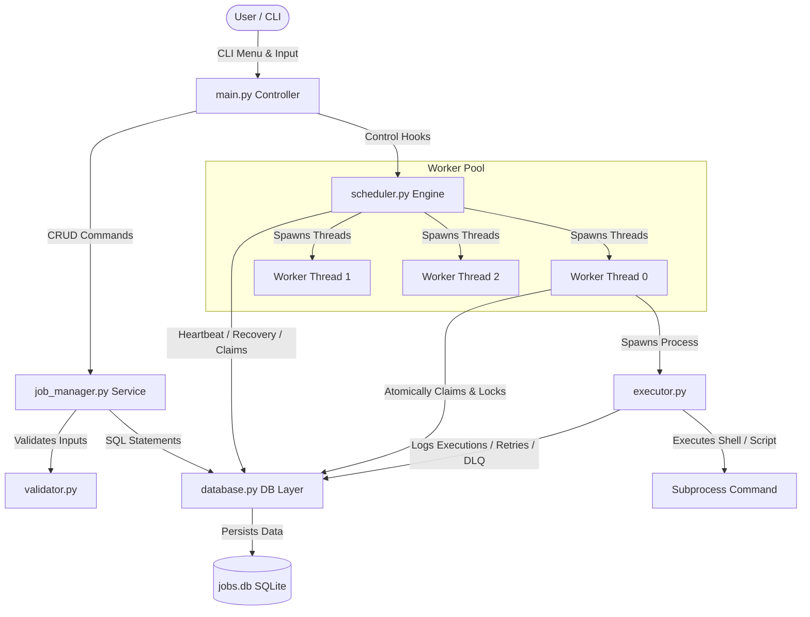
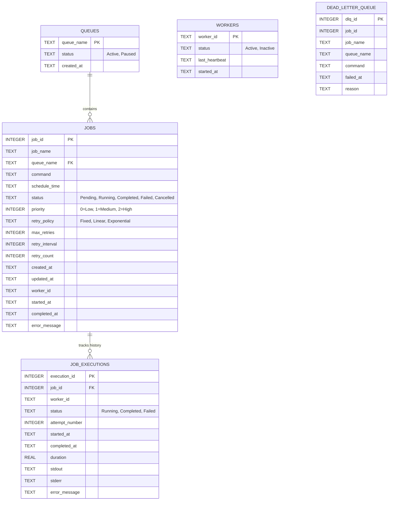
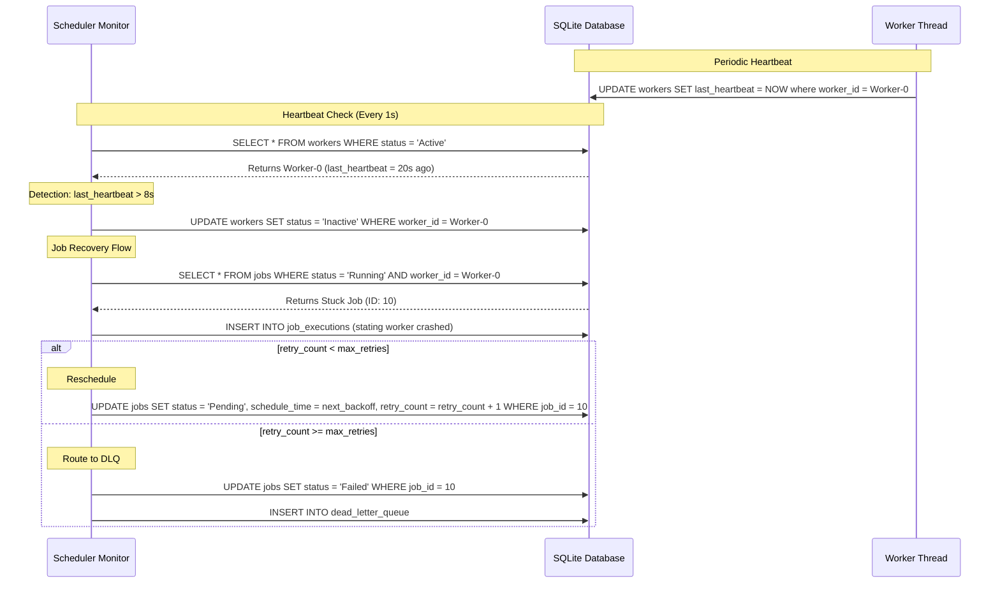

# Architecture Design Document: Production-Quality Job Scheduler

This document details the architectural decisions, database models, concurrency patterns, and workflow pipelines implemented in the distributed-ready Job Scheduler.

---

## 1. System Architecture

Our scheduler leverages a multi-threaded, polling-based model with transactional databases. The components are decoupled following clean architecture boundaries:



### Module Responsibilities
- **`main.py`**: The CLI UI driver, coordinates startups, serves the DevOps Operations Dashboard, handles menu navigation, and safely hooks shutdown triggers.
- **`config.py`**: Declares central timing thresholds (`WORKER_TIMEOUT`, `WORKER_HEARTBEAT_INTERVAL`), database configurations, and filesystem structure.
- **`database.py`**: Contains SQL statements, table initializations, indices, parse functions, and uses immediate transaction commands to assure atomic state updates.
- **`validator.py`**: Validates input formatting constraints (past schedule checks, naming constraints, priority values, and pattern checking).
- **`utils.py`**: Shared system utilities including CLI table layout engines and retry backoff delays.
- **`job_manager.py`**: Handles jobs administration, queue status toggling, and formats operational statistics report files.
- **`scheduler.py`**: Runs the heartbeat monitor supervisor loop and controls worker thread pools.
- **`executor.py`**: Launches commands inside OS shells, reads execution streams, tracks durations, and manages failures (routing to retries or DLQ).

---

## 2. Database Schema

The database consists of 5 normalized tables with indexes on status and schedule columns:



---

## 3. Concurrency Control & Atomic Claiming

To prevent race conditions where multiple workers try to execute the same job simultaneously, we use SQLite's database-level write locking via `BEGIN IMMEDIATE TRANSACTION`.

### Claiming Execution Flow:
1. A worker enters `claim_next_job`.
2. It executes `BEGIN IMMEDIATE TRANSACTION`. This locks writing capabilities across other database connections.
3. It fetches the next eligible job candidate using the query:
   ```sql
   SELECT j.* FROM jobs j
   JOIN queues q ON j.queue_name = q.queue_name
   WHERE j.status = 'Pending'
     AND j.schedule_time <= :current_time
     AND q.status = 'Active'
   ORDER BY j.priority DESC, j.schedule_time ASC
   LIMIT 1
   ```
4. If a job is returned, it immediately updates the status:
   ```sql
   UPDATE jobs 
   SET status = 'Running', worker_id = :worker_id, started_at = :current_time
   WHERE job_id = :job_id
   ```
5. The transaction is committed, releasing the lock.
6. The worker receives the claimed job details and begins execution.

This process ensures that a job can be claimed by **exactly one** worker, even if multiple worker threads poll the database at the exact same millisecond.

---

## 4. Heartbeat Monitor & Fault Recovery

If a worker thread crashes or the scheduler process experiences hardware failure, running jobs must not remain stuck in the `Running` state indefinitely.



---

## 5. Retry Policies

We support three backoff calculations:

1. **Fixed Delay**: 
   $$\text{Delay} = \text{Interval}$$
   *Constant waiting periods.*
2. **Linear Delay**: 
   $$\text{Delay} = \text{Interval} \times \text{Attempt}$$
   *Waiting time increases linearly with each retry.*
3. **Exponential Delay**: 
   $$\text{Delay} = \text{Interval} \times 2^{\text{Attempt} - 1}$$
   *Waiting time doubles with each retry, preventing thrashing on resource conflicts.*
